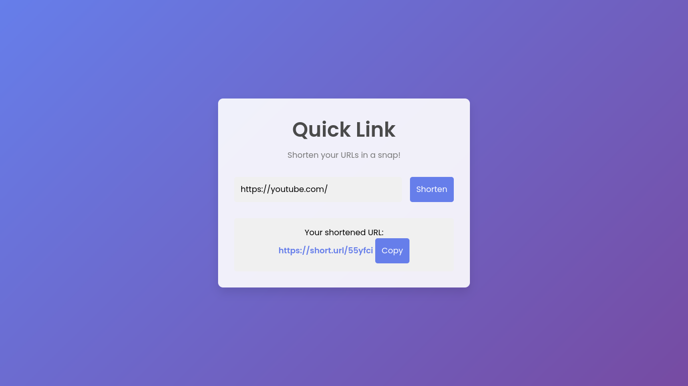

# Responsive-linksorter

# **Languages:**
> HTML CSS JAVASCRIPT ``I'm using internal css and javascript so remember this.``

```
git clone https://github.com/CryptoQuestVikas/Responsive-linksorter
cd Responsive-linksorter
```

1. You need to api key from linkshortner website.
2. Copy api key and paste api on their api section.

# **Screenshot**

